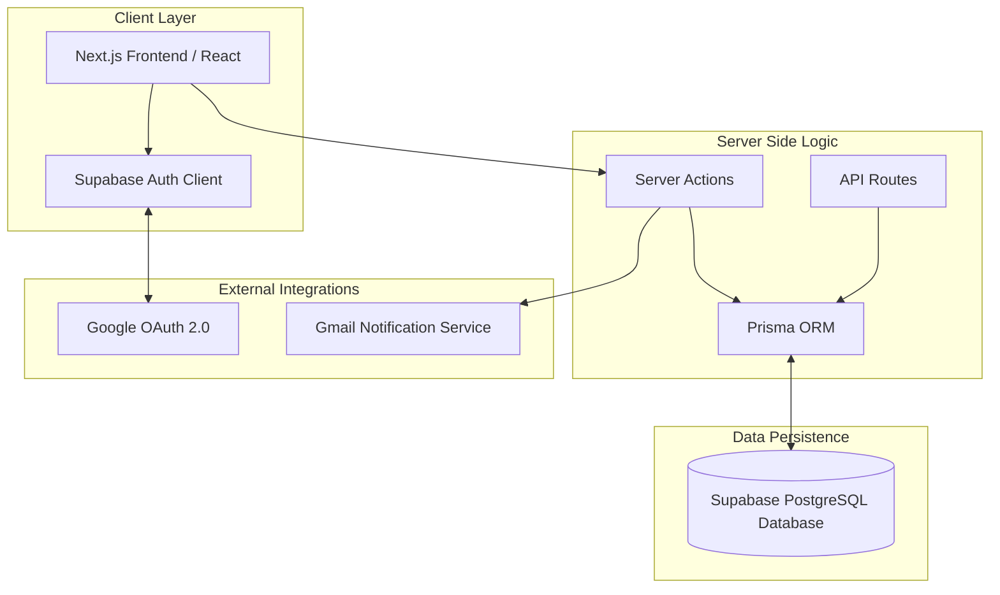
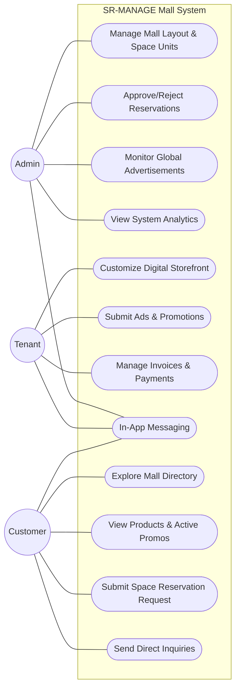
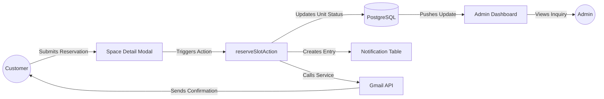
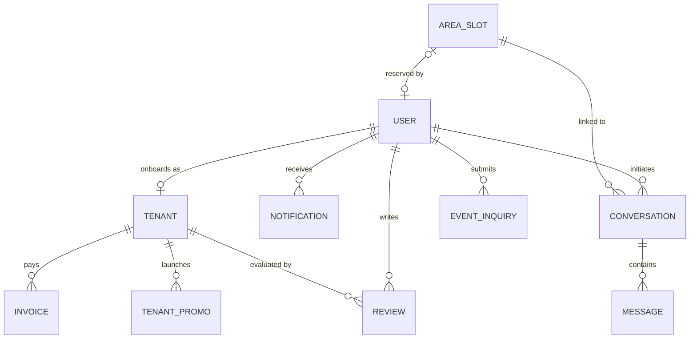
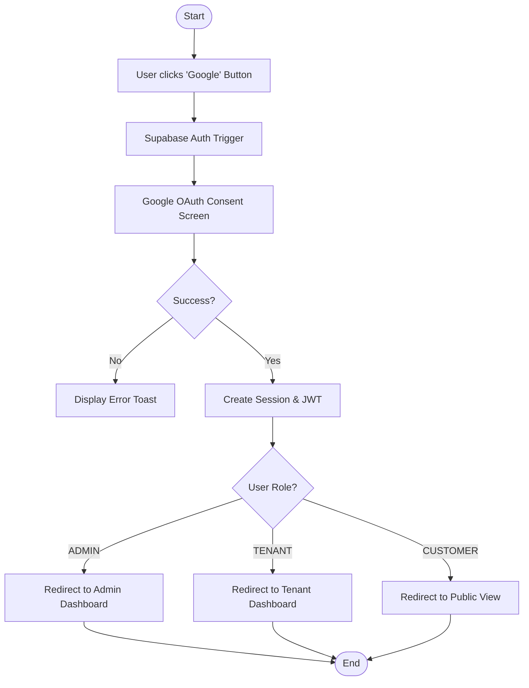
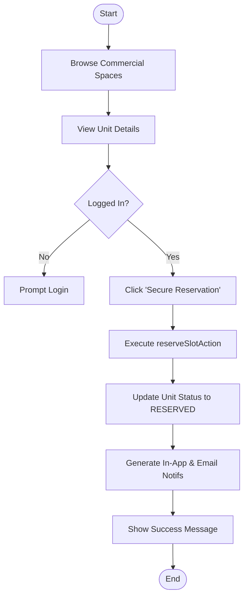

# SR-MANAGE: Technical Documentation Package

This document provides a comprehensive technical overview of the **SR-MANAGE Mall Management System**. The diagrams below are written in **Mermaid.js** syntax for seamless rendering in supported Markdown editors or web viewers.

---

## 1. System Architecture Diagram
Describes the interaction between the Next.js frontend, Supabase services, and external APIs.

[🔗 Open in Mermaid Live](https://mermaid.live/edit#base64:eyJjb2RlIjoiZ3JhcGggVERcbiAgICBzdWJncmFwaCBDbGllbnRfTGF5ZXIgW0NsaWVudCBMYXllcl1cbiAgICAgICAgVUlbTmV4dC5qcyBGcm9udGVuZCAvIFJlYWN0XVxuICAgICAgICBBdXRoX0NsaWVudFtTdXBhYmFzZSBBdXRoIENsaWVudF1cbiAgICBlbmRcblxuICAgIHN1YmdyYXBoIExvZ2ljX0xheWVyIFtTZXJ2ZXIgU2lkZSBMb2dpY11cbiAgICAgICAgU0FbU2VydmVyIEFjdGlvbnNdXG4gICAgICAgIEFQSVtBUEkgUm91dGVzXVxuICAgICAgICBQcmlzbWFbUHJpc21hIE9STV1cbiAgICBlbmRcblxuICAgIHN1YmdyYXBoIEV4dGVybmFsX1NlcnZpY2VzIFtFeHRlcm5hbCBJbnRlZ3JhdGlvbnNdXG4gICAgICAgIEdvb2dsZV9BdXRoW0dvb2dsZSBPQXV0aCAyLjBdXG4gICAgICAgIEdtYWlsX0FQSVtHbWFpbCBOb3RpZmljYXRpb24gU2VydmljZV1cbiAgICBlbmRcblxuICAgIHN1YmdyYXBoIERhdGFfUGVyc2lzdGVuY2UgW0RhdGEgUGVyc2lzdGVuY2VdXG4gICAgICAgIERCWyhTdXBhYmFzZSBQb3N0Z3JlU1FMIERhdGFiYXNlKV1cbiAgICBlbmRcblxuICAgIFVJIC0tPiBTQVxuICAgIFVJIC0tPiBBdXRoX0NsaWVudFxuICAgIEF1dGhfQ2xpZW50IDwtLT4gR29vZ2xlX0F1dGhcbiAgICBTQSAtLT4gUHJpc21hXG4gICAgU0EgLS0+IEdtYWlsX0FQSVxuICAgIFByaXNtYSA8LS0+IERCXG4gICAgQVBJIC0tPiBQcmlzbWEiLCJtZXJtYWlkIjoie1xuICBcInRoZW1lXCI6IFwiZGVmYXVsdFwiXG59IiwidXBkYXRlRWRpdG9yIjpmYWxzZSwiYXV0b1N5bmMiOnRydWUsInVwZGF0ZURpYWdyYW0iOmZhbHNlfQ==)

---

## 2. Use Case Diagram
Identifies the primary actors and their interactions within the SR-MANAGE ecosystem.

[🔗 Open in Mermaid Live](https://mermaid.live/edit#base64:eyJjb2RlIjoiZ3JhcGggTFJcbiAgICBzdWJncmFwaCBNYWxsX1N5c3RlbV9Cb3VuZGFyeSBbU1ItTUFOQUdFIE1hbGwgU3lzdGVtXVxuICAgICAgICBVQzEoW01hbmFnZSBNYWxsIExheW91dCAmIFNwYWNlIFVuaXRzXSlcbiAgICAgICAgVUMyKFtBcHByb3ZlL1JlamVjdCBSZXNlcnZhdGlvbnNdKVxuICAgICAgICBVQzMoW01vbml0b3IgR2xvYmFsIEFkdmVydGlzZW1lbnRzXSlcbiAgICAgICAgVUM0KFtWaWV3IFN5c3RlbSBBbmFseXRpY3NdKVxuICAgICAgICBcbiAgICAgICAgVUM1KFtDdXN0b21pemUgRGlnaXRhbCBTdG9yZWZyb250XSlcbiAgICAgICAgVUM2KFtTdWJtaXQgQWRzICYgUHJvbW90aW9uc10pXG4gICAgICAgIFVDNyhbTWFuYWdlIEludm9pY2VzICYgUGF5bWVudHNfKVxuICAgICAgICBVQzgoW0luLUFwcCBNZXNzYWdpbmddKVxuICAgICAgICBcbiAgICAgICAgVUM5KFtFeHBsb3JlIE1hbGwgRGlyZWN0b3J5XSlcbiAgICAgICAgVUMxMChbVmlldyBQcm9kdWN0cyAmIEFjdGl2ZSBQcm9tb3NdKVxuICAgICAgICBVQzExKFtTdWJtaXQgU3BhY2UgUmVzZXJ2YXRpb24gUmVxdWVzdF0pXG4gICAgICAgIFVDMTIoW1NlbmQgRGlyZWN0IElucXVpcmllc10pXG4gICAgZW5kXG5cbiAgICBBZG1pbigoQWRtaW4pKSAtLS0gVUMxXG4gICAgQWRtaW4gLS0tIFVDMlxuICAgIEFkbWluIC0tLSBVQzNcbiAgICBBZG1pbiAtLS0gVUM0XG4gICAgQWRtaW4gLS0tIFVDOFxuXG4gICAgVGVuYW50KChUZW5hbnQpKSAtLS0gVUM1XG4gICAgVGVuYW50IC0tLSBVQzZcbiAgICBUZW5hbnQgLS0tIFVDN1xuICAgIFRlbmFudCAtLS0gVUM4XG5cbiAgICBDdXN0b21lcigoQ3VzdG9tZXIpKSAtLS0gVUM5XG4gICAgQ3VzdG9tZXIgLS0tIFVDMTBcbiAgICBDdXN0b21lciAtLT0gVUMxMVxuICAgIEN1c3RvbWVyIC0tLSBVQzEyXG4gICAgQ3VzdG9tZXIgLS0tIFVDOCIsIm1lcm1haWQiOiJ7XG4gIFwidGhlbWVcIjogXCJkZWZhdWx0XCJcbn0iLCJ1cGRhdGVFZGl0b3IiOmZhbHNlLCJhdXRvU3luYyI6dHJ1ZSwidXBkYXRlRGlhZ3JhbSI6ZmFsc2V9)

---

## 3. Data Flow Diagram (DFD)
Visualizes how information (e.g., a reservation) flows from user input to the database and back to the UI.

[🔗 Open in Mermaid Live](https://mermaid.live/edit#base64:eyJjb2RlIjoiZ3JhcGggTFJcbiAgICBVc2VyKChDdXN0b21lcikpIC0tIFwiU3VibWl0cyBSZXNlcnZhdGlvblwiIC0tPiBVSVtTcGFjZSBEZXRhaWwgTW9kYWxdXG4gICAgVUkgLS0gXCJUcmlnZ2VycyBBY3Rpb25cIiAtLT4gU0FbcmVzZXJ2ZVNsb3RBY3Rpb25dXG4gICAgU0EgLS0gXCJVcGRhdGVzIFVuaXQgU3RhdHVzXCIgLS0+IERCWyhQb3N0Z3JlU1FMKV1cbiAgICBTQSAtLTBcIkNyZWF0ZXMgRW50cnlcIiAtLT4gTm90aWZbTm90aWZpY2F0aW9uIFRhYmxlXVxuICAgIFNBIC0tIFwiQ2FsbHMgU2VydmljZVwiIC0tPiBHbWFpbFtHbWFpbCBBUEldXG4gICAgR21haWwgLS0gXCJTZW5kcyBDb25maXJtYXRpb25cIiAtLT4gVXNlclxuICAgIERCIC0tIFwiUHVzaGVzIFVwZGF0ZVwiIC0tPiBBZG1pbkRhc2hbQWRtaW4gRGFzaGJvYXJkXVxuICAgIEFkbWluRGFzaCAtLTBcIlZpZXdzIElucXVpcnlcIiAtLT4gQWRtaW4oKEFkbWluKSkiLCJtZXJtYWlkIjoie1xuICBcInRoZW1lXCI6IFwiZGVmYXVsdFwiXG59IiwidXBkYXRlRWRpdG9yIjpmYWxzZSwiYXV0b1N5bmMiOnRydWUsInVwZGF0ZURpYWdyYW0iOmZhbHNlfQ==)

---

## 4. Entity Relationship Diagram (ERD)
Defines the relationships between core database entities based on the `schema.prisma`.

[🔗 Open in Mermaid Live](https://mermaid.live/edit#base64:eyJjb2RlIjoiZXJEaWFncmFtXG4gICAgVVNFUiB8fC0tb3wgVEVOQU5UIDogXCJvbmJvYXJkcyBhc1wiXG4gICAgVVNFUiB8fC0tb3sgTk9USUZJQ0FUSU9OIDogXCJyZWNlaXZlc1wiXG4gICAgVVNFUiB8fC0tb3sgQ09OVkVSU0FUSU9OIDogXCJpbml0aWF0ZXNcIlxuICAgIFVTRVIgfHwtLW97IFJFVklFVyA6IFwid3JpdGVzXCJcbiAgICBVU0VSIHx8LS1veyBFVkVOVF9JTlFVSVJZIDogXCJzdWJtaXRzXCJcbiAgICBcbiAgICBURU5BTlQgfHwtLW97IElOVk9JQ0UgOiBcInBheXNcIlxuICAgIFRFTkFOVCB8fC0tb3sgVEVOQU5UX1BST01PIDogXCJsYXVuY2hlc1wiXG4gICAgVEVOQU5UIHx8LS1veyBSRVZJRVcgOiBcImV2YWx1YXRlZCBieVwiXG4gICAgXG4gICAgQVJFQV9TTE9UIHx8LS1veyBDT05WRVJTQVRJT04gOiBcImxpbmtlZCB0b1wiXG4gICAgQVJFQV9TTE9UIHxvLS1vfCBVU0VSIDogXCJyZXNlcnZlZCBieVwiXG4gICAgXG4gICAgQ09OVkVSU0FUSU9OIHx8LS1veyBNRVNTQUdFIDogXCJjb250YWluc1wiIiwibWVybWFpZCI6IntcbiAgXCJ0aGVtZVwiOiBcImRlZmF1bHRcIlxufSIsInVwZGF0ZUVkaXRvciI6ZmFsc2UsImF1dG9TeW5jIjp0cnVlLCJ1cGRhdGVEaWFncmFtIjpmYWxzZX0=)

---

## 5. Activity Diagrams / Flowcharts

### Google Login Flow
The step-by-step logic for authenticating via Google OAuth.

[🔗 Open in Mermaid Live](https://mermaid.live/edit#base64:eyJjb2RlIjoiZmxvd2NoYXJ0IFREXG4gICAgU3RhcnQoW1N0YXJ0XSkgLS0+IExvZ2luQ2xpY2tbVXNlciBjbGlja3MgJ0dvb2dsZScgQnV0dG9uXVxuICAgIExvZ2luQ2xpY2sgLS0+IFN1cGFBdXRoW1N1cGFiYXNlIEF1dGggVHJpZ2dlcl1cbiAgICBTdXBhQXV0aCAtLT4gR29vZ2xlQ29uc2VudFtHb29nbGUgT0F1dGggQ29uc2VudCBTY3JlZW5dXG4gICAgR29vZ2xlQ29uc2VudCAtLT4gQ2FsbGJhY2t7U3VjY2Vzcz99XG4gICAgQ2FsbGJhY2sgLS0gTm8gLS0+IEVycm9yW0Rpc3BsYXkgRXJyb3IgVG9hc3RdXG4gICAgQ2FsbGJhY2sgLS0gWWVzIC0tPiBTZXNzaW9uW0NyZWF0ZSBTZXNzaW9uICYgSldUXVxuICAgIFNlc3Npb24gLS0+IFJvbGVDaGVja3tVc2VyIFJvbGU/fVxuICAgIFJvbGVDaGVjayAtLSBBRE1JTiAtLT4gQWRtaW5EW1JlZGlyZWN0IHRvIEFkbWluIERhc2hib2FyZF1cbiAgICBSb2xlQ2hlY2sgLS0gVEVOQU5UIC0tPiBUZW5hbnREW1JlZGlyZWN0IHRvIFRlbmFudCBEYXNoYm9hcmRdXG4gICAgUm9sZUNoZWNrIC0tIENVU1RPTUVSIC0tPiBQdWJsaWNbUmVkaXJlY3QgdG8gUHVibGljIFZpZXddXG4gICAgQWRtaW5EICYgVGVuYW50RCAmIFB1YmxpYyAtLT4gRW5kKFtFbmRdKSIsIm1lcm1haWQiOiJ7XG4gIFwidGhlbWVcIjogXCJkZWZhdWx0XCJcbn0iLCJ1cGRhdGVFZGl0b3IiOmZhbHNlLCJhdXRvU3luYyI6dHJ1ZSwidXBkYXRlRGlhZ3JhbSI6ZmFsc2V9)

### Tenant Reservation Flow
The logic for a potential tenant to secure a mall unit.

[🔗 Open in Mermaid Live](https://mermaid.live/edit#base64:eyJjb2RlIjoiZmxvd2NoYXJ0IFREXG4gICAgUyhbU3RhcnRdKSAtLT4gQnJvd3NlW0Jyb3dzZSBDb21tZXJjaWFsIFNwYWNlc11cbiAgICBCcm93c2UgLS0+IERldGFpbFtWaWV3IFVuaXQgRGV0YWlsc11cbiAgICBEZXRhaWwgLS0+IEF1dGhDaGVja3tMb2dnZWQgSW4/fVxuICAgIEF1dGhDaGVjayAtLSBObyAtLT4gTG9naW5bUHJvbXB0IExvZ2luXVxuICAgIEF1dGhDaGVjayAtLSBZZXMgLS0+IFJlc2VydmVbQ2xpY2sgJ1NlY3VyZSBSZXNlcnZhdGlvbiddXG4gICAgUmVzZXJ2ZSAtLT4gQWN0aW9uW0V4ZWN1dGUgcmVzZXJ2ZVNsb3RBY3Rpb25dXG4gICAgQWN0aW9uIC0tPiBEQlVwZGF0ZVtVcGRhdGUgVW5pdCBTdGF0dXMgdG8gUkVTRVJWRURdXG4gICAgREJVcGRhdGUgLS0+IE5vdGlmeVtHZW5lcmF0ZSBJbi1BcHAgJiBFbWFpbCBOb3RpZnNdXG4gICAgTm90aWZ5IC0tPiBGZWVkYmFja1tTaG93IFN1Y2Nlc3MgTWVzc2FnZV1cbiAgICBGZWVkYmFjayAtLT4gRW5kKFtFbmRdKSIsIm1lcm1haWQiOiJ7XG4gIFwidGhlbWVcIjogXCJkZWZhdWx0XCJcbn0iLCJ1cGRhdGVFZGl0b3IiOmZhbHNlLCJhdXRvU3luYyI6dHJ1ZSwidXBkYXRlRGlhZ3JhbSI6ZmFsc2V9)

---

## 6. Database Design (Table Descriptions)

This section provides a detailed breakdown of the PostgreSQL schema managed via Prisma.

### 6.1 Core User Management
| Table: `User` | Description: Stores all system users and their authentication roles. |
| :--- | :--- |
| **Column** | **Type** | **Description** |
| `id` | `String (UUID)` | Primary Key. Unique identifier for the user. |
| `email` | `String` | Unique email address used for login. |
| `name` | `String?` | Optional display name of the user. |
| `password` | `String` | Hashed password for local authentication. |
| `role` | `String` | User permission level (`ADMIN`, `TENANT`, `CUSTOMER`). |
| `isBlacklisted` | `Boolean` | Flag to restrict access for malicious users. |
| `createdAt` | `DateTime` | Timestamp of account creation. |

### 6.2 Merchant & Leasing
| Table: `Tenant` | Description: Extended profiles for mall shop owners. |
| :--- | :--- |
| **Column** | **Type** | **Description** |
| `id` | `String (UUID)` | Primary Key. |
| `shopName` | `String` | Commercial name of the tenant's shop. |
| `unitId` | `String` | The physical mall unit ID assigned to the tenant. |
| `userId` | `String (FK)` | Links to the `User` table (Owner). |
| `status` | `String` | Business status (`ACTIVE`, `INACTIVE`). |
| `products` | `Json` | Array of products available in the storefront. |

| Table: `AreaSlot` | Description: Records of all physical spaces/units in the mall. |
| :--- | :--- |
| **Column** | **Type** | **Description** |
| `unit_id` | `String` | Unique identifier for the unit (e.g., "A-101"). |
| `status` | `String` | Current availability (`AVAILABLE`, `RESERVED`, `OCCUPIED`). |
| `sqm_size` | `Float` | Total area size in square meters. |
| `base_rent` | `Float` | Starting monthly rent amount. |
| `space_images`| `String[]` | Array of URLs showing the unit's layout. |

### 6.3 Billing & Marketing
| Table: `Invoice` | Description: Monthly rent and utility billing for tenants. |
| :--- | :--- |
| **Column** | **Type** | **Description** |
| `invoiceNumber`| `String` | Unique reference for the bill. |
| `amount` | `Float` | Total amount due. |
| `status` | `String` | Payment status (`PENDING`, `PAID`, `OVERDUE`). |
| `dueDate` | `DateTime` | Deadline for the payment. |
| `tenantId` | `String (FK)` | Recipient of the invoice. |

| Table: `TenantPromo`| Description: Advertisements and campaigns submitted by tenants. |
| :--- | :--- |
| **Column** | **Type** | **Description** |
| `title` | `String` | Heading of the promotion. |
| `category` | `String` | Industry category (e.g., "Fashion", "Dining"). |
| `status` | `String` | Admin approval status (`PENDING`, `APPROVED`). |
| `mediaType` | `String` | Type of promo content (`IMAGE` or `VIDEO`). |

### 6.4 Communication & Feedback
| Table: `Conversation` | Description: Message threads for support and inquiries. |
| :--- | :--- |
| **Column** | **Type** | **Description** |
| `id` | `String (UUID)` | Primary Key. |
| `type` | `String` | Type of conversation (e.g., "Leasing Inquiry"). |
| `userId` | `String (FK)` | The user who initiated the thread. |
| `targetId` | `String (FK)` | The recipient (usually an Admin). |

| Table: `Notification` | Description: In-app alerts for system events. |
| :--- | :--- |
| **Column** | **Type** | **Description** |
| `type` | `String` | Event category (`NEW_BOOKING`, `PAYMENT_DUE`). |
| `title` | `String` | Short summary of the alert. |
| `isRead` | `Boolean` | Tracking whether the user has seen the alert. |

### 6.5 System Configuration
| Table: `SiteConfig` | Description: Global settings for the public portal. |
| :--- | :--- |
| **Column** | **Type** | **Description** |
| `heroTitle` | `String` | Main text on the landing page. |
| `isMaintenance`| `Boolean` | Master switch to disable the public portal. |
| `heroBgUrl` | `String?` | Background image for the hero section. |

